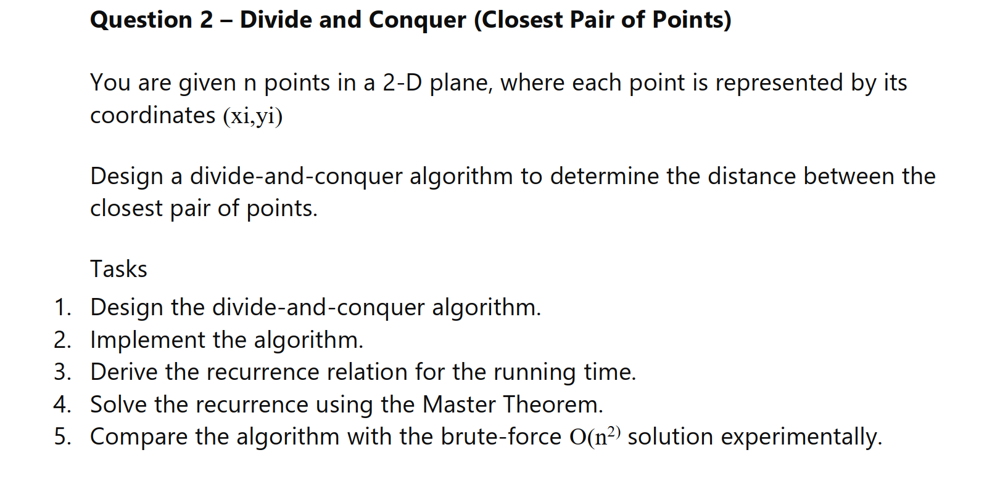

Closest Pair of Points



Main Goal:

Given a set of points in the plane, find the minimum Euclidean distance between any two points.

The program in [problem2.c](problem2.c) implements a divide-and-conquer solution for this problem.


How It Works

1. Sort the points by x-coordinate.
2. Split the set into two halves around the median x-value.
3. Recursively find the closest pair in the left half and the right half.
4. Let delta be the smaller of those two distances.
5. Build a strip of points whose x-distance from the middle line is less than delta.
6. Sort the strip by y-coordinate.
7. For each point in the strip, compare it only with the next few points whose y-distance is still smaller than delta.
8. The smallest distance found in all three places is the answer.

Why this works:
- A closest pair can be entirely in the left half.
- Or entirely in the right half.
- Or it can cross the dividing line.
- The strip step checks that cross-boundary case efficiently.


Step-By-Step Example

Suppose the points are:

(2,3), (12,30), (40,50), (5,1), (12,10), (3,4)

After sorting by x-coordinate:

(2,3), (3,4), (5,1), (12,10), (12,30), (40,50)

The set is split into two halves.

The recursion finds:
- left-half closest distance
- right-half closest distance

Then the algorithm checks the strip around the middle line to catch pairs such as (2,3) and (3,4), which may be closer than the best pair found inside either half alone.


Time Complexity

For this implementation:

- Sorting by x at the top level: O(n log n)
- Recursive split into two halves: 2T(n/2)
- Strip sorting at each level: O(n log n)

So the recurrence is:

T(n) = 2T(n/2) + O(n log n)

This gives:

Total: O(n log^2 n)


Space Complexity

- O(n) for copying and strip storage per level of work
- Recursion stack: O(log n)


Correctness Intuition

The algorithm is correct because it checks all possible locations of the closest pair:

1. Both points in the left half.
2. Both points in the right half.
3. One point in each half, inside the strip.

The strip can be scanned efficiently because after sorting by y, a point only needs to be compared with a small number of nearby points. This is the key geometric fact behind the divide-and-conquer method.


Where This Version Falls Short

This implementation is not the full optimal O(n log n) version.

Reason:
- It re-sorts the strip by y at every recursive level.
- That extra sorting cost makes the total complexity O(n log^2 n).

The true O(n log n) solution keeps a y-sorted list through recursion instead of sorting the strip again each time.


Copy-Paste Test Cases For problem2.c

Use these as direct input examples when testing the core functions manually or by adding a temporary test block.

```c
/* 1) Classic 6-point set */
Point test[] = {
	{2,3}, {12,30}, {40,50}, {5,1}, {12,10}, {3,4}
};

/* 2) Two points */
Point test[] = {
	{0,0}, {1,1}
};

/* 3) Collinear on x-axis */
Point test[] = {
	{0,0}, {3,0}, {7,0}
};

/* 4) Vertical line */
Point test[] = {
	{5,1}, {5,4}, {5,8}, {5,2}
};

/* 5) Closest pair crosses the dividing line */
Point test[] = {
	{0,0}, {10,0}, {4.9,0}, {5.1,0}
};

/* 6) Duplicate points */
Point test[] = {
	{1,1}, {3,5}, {1,1}, {7,2}
};

/* 7) Negative coordinates */
Point test[] = {
	{-5,-3}, {-1,2}, {4,-2}, {-4,-4}, {3,3}
};

/* 8) All points identical */
Point test[] = {
	{7,7}, {7,7}, {7,7}, {7,7}
};

/* 9) Unit square vertices */
Point test[] = {
	{0,0}, {1,0}, {1,1}, {0,1}
};
```

If you want to add a quick temporary main for testing, use this pattern:

```c
int main(void) {
	Point test[] = { {2,3}, {12,30}, {40,50}, {5,1}, {12,10}, {3,4} };
	int n = (int)(sizeof(test) / sizeof(test[0]));
	double answer = closest_pair_dc(test, n);
	printf("Closest distance: %.6f\n", answer);
	return 0;
}
```

Note:
- [problem2.c](problem2.c) currently has a minimal main function.
- To run a test case, temporarily paste one Point test[] block into main and print the result.
