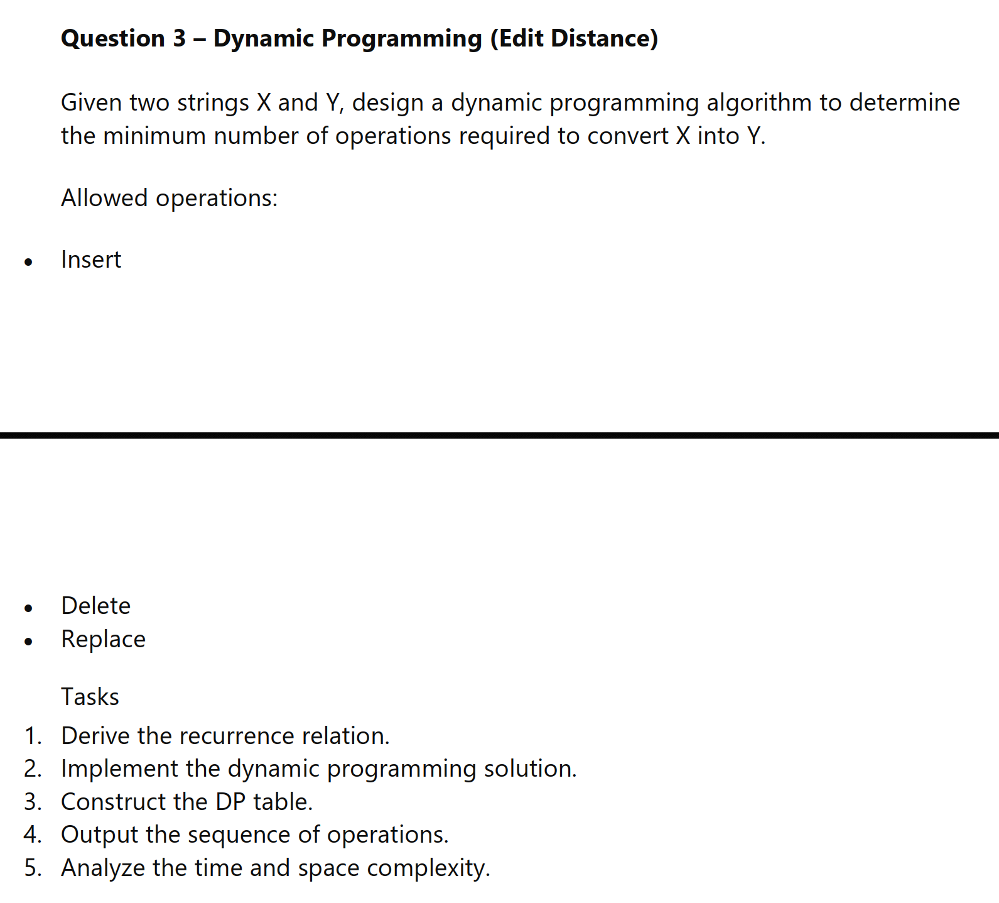

Edit Distance - Dynamic Programming


Main Goal:

Given two strings X and Y, find the minimum number of operations required to convert X into Y.

Allowed operations:
- Insert
- Delete
- Replace

This is also known as the Levenshtein distance problem.

How It Works

The solution uses dynamic programming.

Let dp[i][j] be the minimum number of operations needed to convert:
- the first i characters of X
- into the first j characters of Y

If we know all smaller subproblems, we can build the final answer in dp[m][n].

Recurrence Relation

Let X[i-1] and Y[j-1] be the current characters.

1. If the characters are equal:

dp[i][j] = dp[i-1][j-1]

2. If the characters are different:

dp[i][j] = 1 + min(
    dp[i-1][j],     // delete
    dp[i][j-1],     // insert
    dp[i-1][j-1]    // replace
)

Base cases:
- dp[0][j] = j
  Converting empty string to a string of length j needs j insertions.
- dp[i][0] = i
  Converting a string of length i to empty string needs i deletions.

Step-by-Step Working

1. Create a DP table of size (m+1) x (n+1).
2. Fill the first row and first column using the base cases.
3. Fill the rest of the table row by row.
4. The value in the last cell dp[m][n] is the minimum edit distance.
5. Trace back from dp[m][n] to dp[0][0] to recover the sequence of operations.

Why This Works

Each cell represents a smaller subproblem.

For every character pair, the algorithm tries the three possible edits:
- delete a character from X
- insert a character into X
- replace a character in X

The DP table guarantees that each subproblem is solved only once, so the final answer is optimal.

Example

For:
- X = "sunday"
- Y = "saturday"

One optimal sequence is:
1. Insert 'a'
2. Insert 't'
3. Replace 'n' with 'r'

Total operations = 3

DP Table

The program prints the full DP table, where:
- rows represent prefixes of X
- columns represent prefixes of Y
- dp[i][j] is the edit distance for those prefixes

Time Complexity

Let m = length of X and n = length of Y.

- Filling the table: O(mn)
- Backtracking operations: O(m + n)
- Total: O(mn)

Space Complexity

- DP table: O(mn)
- Operation trace: O(m + n)
- Total: O(mn)

Where This Is Used

This algorithm is used in:
- spell checking
- autocomplete
- DNA sequence comparison
- diff tools
- typo correction

Copy-Paste Test Cases For problem3.c

Use the current pattern in [problem3.c](problem3.c): paste any two strings into main and run.

```c
const char *X = "sunday";
const char *Y = "saturday";
```

```c
const char *X = "kitten";
const char *Y = "sitting";
```

```c
const char *X = "flaw";
const char *Y = "lawn";
```

```c
const char *X = "intention";
const char *Y = "execution";
```

```c
const char *X = "abc";
const char *Y = "abc";
```

```c
const char *X = "";
const char *Y = "abc";
```

```c
const char *X = "abc";
const char *Y = "";
```

How to Run

1. Open [problem3.c](problem3.c)
2. Replace the strings X and Y in main
3. Compile:

```bash
gcc -O2 -o problem3 problem3.c
```

4. Run:

```bash
./problem3
```

Expected Output

The program prints:
- the input strings
- the minimum edit distance
- the DP table
- the sequence of operations

Notes

- If the strings are already equal, the answer is 0.
- If one string is empty, the answer is the length of the other string.
- The program prints one valid optimal sequence of operations.
